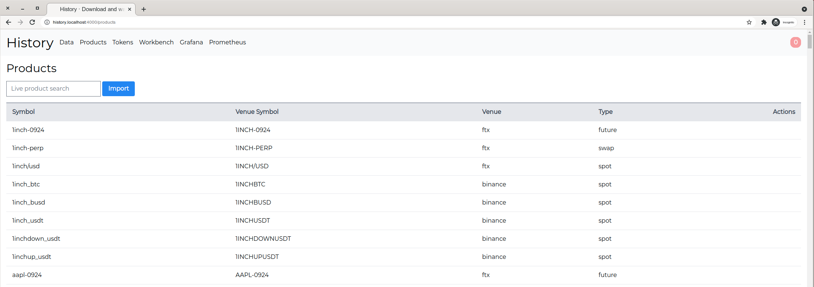
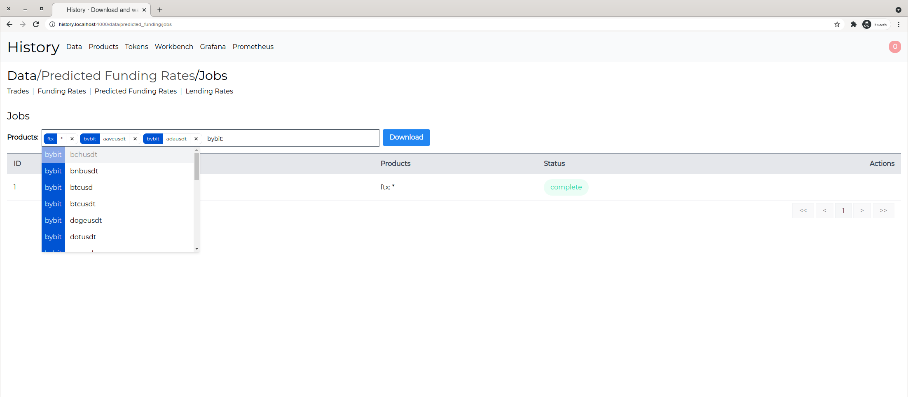
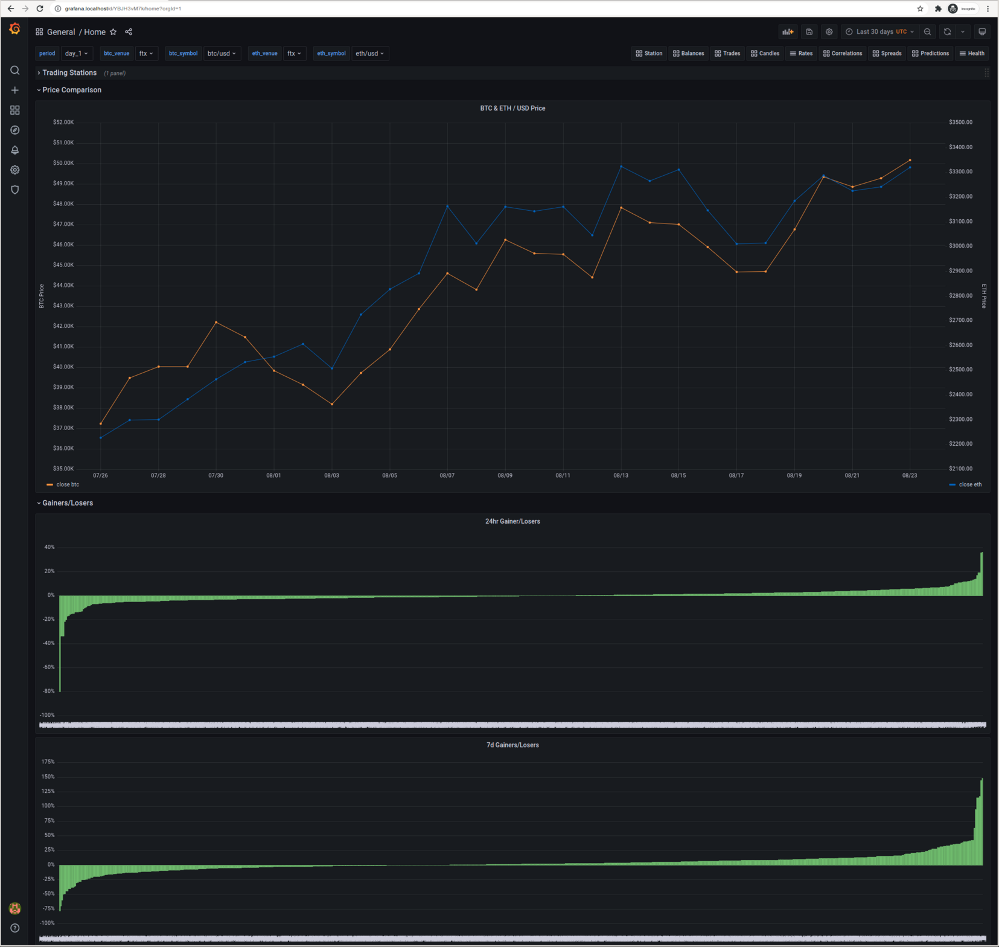
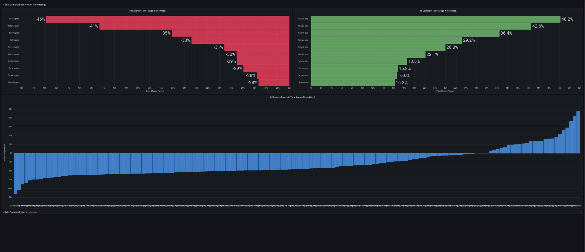

# History
[](https://github.com/fremantle-industries/history/actions?query=workflow%3Atest)
[](https://hex.pm/packages/history)

Download and warehouse historical trading data

## Install

Add `history` to your list of dependencies in `mix.exs`

```elixir
def deps do
  [
    {:history, "~> 0.0.15"}
  ]
end
```

## Usage

```bash
$ docker-compose up
```

Visit [`history.localhost`](http://history.localhost)

When running the application with `docker-compose` you will need to enter the basic auth development credentials:

```
username: admin
password: password
```

## Requirements

`history` requires Elixir 1.11+ & Erlang/OTP 22+

## Features

### Import Products From Tai



### Download Historical Venue Data




### Visualize & Explore Data for Market Insights






## Venues

| Venues   | Trades | Candles | Funding Rates | Predicted Funding Rates | Lending Rates |
| -------- | :----: | :-----: | :-----------: | :---------------------: | :-----------: |
| FTX      |  [x]   |   [x]   |      [x]      |           [x]           |      [x]      |
| OkEx     |  [ ]   |   [ ]   |      [ ]      |           [ ]           |      [ ]      |
| BitMEX   |  [ ]   |   [ ]   |      [ ]      |           [ ]           |      [ ]      |
| Binance  |  [ ]   |   [ ]   |      [ ]      |           [ ]           |      [ ]      |
| Deribit  |  [ ]   |   [ ]   |      [ ]      |           [ ]           |      [ ]      |
| GDAX     |  [ ]   |   [ ]   |      [ ]      |           [ ]           |      [ ]      |
| Huobi    |  [ ]   |   [ ]   |      [ ]      |           [ ]           |      [ ]      |
| Bybit    |  [ ]   |   [ ]   |      [ ]      |           [ ]           |      [ ]      |
| bit.com  |  [ ]   |   [ ]   |      [ ]      |           [ ]           |      [ ]      |
| Bitfinex |  [ ]   |   [ ]   |      [ ]      |           [ ]           |      [ ]      |
| Kraken   |  [ ]   |   [ ]   |      [ ]      |           [ ]           |      [ ]      |
| CME      |  [ ]   |   [ ]   |      [ ]      |           [ ]           |      [ ]      |
| Phemex   |  [ ]   |   [ ]   |      [ ]      |           [ ]           |      [ ]      |
| BTSE     |  [ ]   |   [ ]   |      [ ]      |           [ ]           |      [ ]      |
| KuCoin   |  [ ]   |   [ ]   |      [ ]      |           [ ]           |      [ ]      |
| BitMax   |  [ ]   |   [ ]   |      [ ]      |           [ ]           |      [ ]      |
| MEXC     |  [ ]   |   [ ]   |      [ ]      |           [ ]           |      [ ]      |
| PrimeXBT |  [ ]   |   [ ]   |      [ ]      |           [ ]           |      [ ]      |
| Gate.io  |  [ ]   |   [ ]   |      [ ]      |           [ ]           |      [ ]      |
| Coinflex |  [ ]   |   [ ]   |      [ ]      |           [ ]           |      [ ]      |
| bitFlyer |  [ ]   |   [ ]   |      [ ]      |           [ ]           |      [ ]      |

## Development

Initial setup:

- Installs `hex` and `npm` dependencies
- Generates migrations for history, workbench and tai
- Runs migrations
- Seeds database

```bash
$ docker-compose up db
$ mix setup
$ mix phx.server
```

## Test

```bash
$ docker-compose up db
$ mix test
```

## Ecto Database

Reset drops the db, creates a new db & runs the migrations

```bash
$ mix ecto.reset
```

Migrate up

```bash
$ mix ecto.migrate
```

Migrate down

```bash
# Last migration
$ mix ecto.rollback
# Last 3 migrations
$ mix ecto.rollback -n 3
```

## Help Wanted :)

If you think this `history` thing might be worthwhile and you don't see a feature
or venue listed we would love your contributions to add them! Feel free to
drop us an email or open a Github issue.

## Authors

- Alex Kwiatkowski - alex+git@fremantle.io

## License

`history` is released under the [MIT license](./LICENSE)
