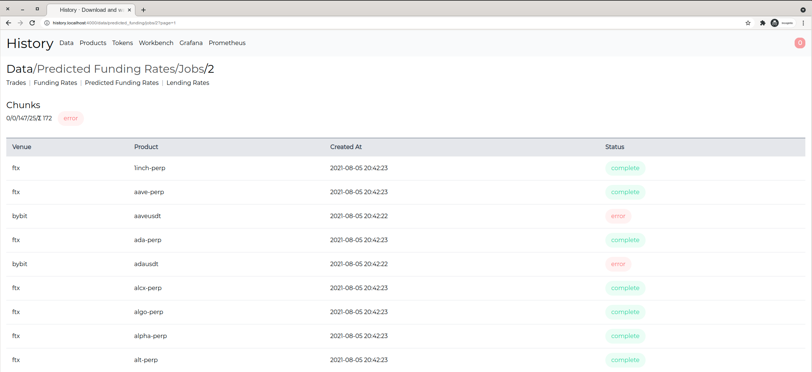
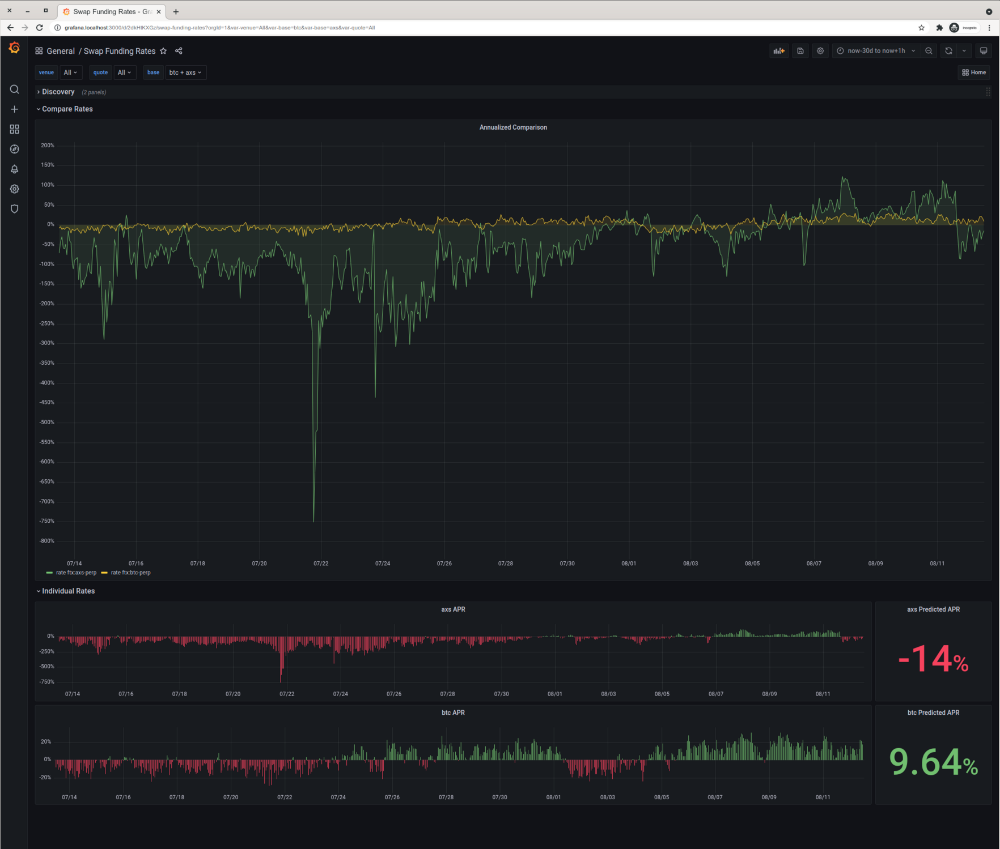

# History
[](https://github.com/fremantle-industries/history/actions?query=workflow%3Atest)
[](https://hex.pm/packages/history)

Download and warehouse historical trading data

## Install

Add `history` to your list of dependencies in `mix.exs`

```elixir
def deps do
  [
    {:history, "~> 0.0.1"}
  ]
end
```

## Usage

```bash
$ docker-compose up
```

Visit [`history.localhost:4000`](http://history.localhost:4000)

## Features

### Import Products From Tai


### Download Historical Venue Data



### Visualize & Explore Data for Market Insights



## Development

```bash
$ docker-compose up db
$ mix phx.server
```

## Test

```bash
$ docker-compose up db
$ mix test
```

## Ecto Database

Reset drops the db, creates a new db & runs the migrations

```bash
$ mix ecto.reset
```

Migrate up

```bash
$ mix ecto.migrate
```

Migrate down

```bash
# Last migration
$ mix ecto.rollback
# Last 3 migrations
$ mix ecto.rollback -n 3
```
